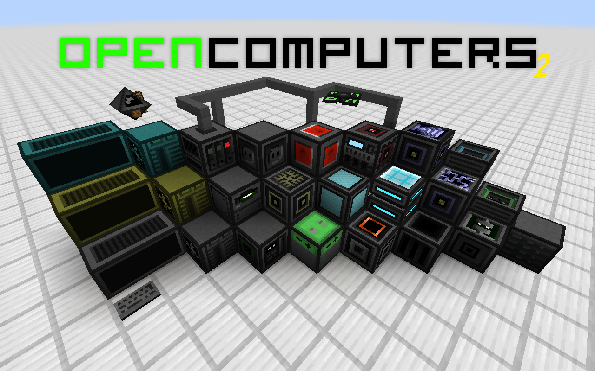

# [OpenComputers](https://github.com/MightyPirates/OpenComputers) 2

This is a fork of OpenComputers intended to rebuild it ground-up for Fabric.

## A slight mess caused by licenses

> This mod is licensed under the MIT license. All assets are public domain unless otherwise stated; all are free to be distributed as long as the license/source credits are kept.

That's what is said in [former OpenComputers' README.md](https://github.com/MightyPirates/OpenComputers/blob/master-MC1.7.10/README.md)

Now, what does that mean? It means that everything is licensed under MIT except files stored in `/assets/.` and `/src/main/resources/.` because those files are assets, so they belong to the public domain meaning you can do whatever you want with them.  That includes changing licenses (or at least I think so - there is a slight chance I just accidentally committed a license fraud).

So - I [changed the license](https://github.com/GuzioMG/OpenComputers/commit/2c3a50c364f2cc3e408500ce086b9caaf13d82f2). The new one is GPL2.

> Hol'up! U cant just randomly change licenses!!!

That's right - there's indeed a little catch:

* First of all, whatever enters the public domain - stays in the public domain forever. This is why original assets still belong to... every single human being, basically. That's said, all the alterations belong* to me under GPL2. So, if I adjust the hue of an individual pixel on top of a texture, everything around that pixel is still public domain, the previous version of the image is also PD, but that pixel is now GPL2. Or at least I think so - there is a significant chance I just accidentally committed license fraud, which is less than ideal. _*"belong" might not have been the best choice of words here, but nobody cares._

* Second of all, I had to [nuke the source code and everything that's not an asset](https://github.com/GuzioMG/OpenComputers/commit/20ca1cbef24ef27c3b73fbc9202b4b6453e02431). Now in most cases of Fabric-ports, that should not be a problem. Here it is. That's because I skipped a few files. They were fixed in [the next commit](https://github.com/GuzioMG/OpenComputers/commit/3d2faf9a7c8d348ded065d36847e3c2712a59de9). But even then - I still skipped 3 files. Those files were `/LICENSE`, `/README.md` and `/.gitignore` because:

> I was planning on fully replacing the first 2 ones.

> I just decided that the `.gitignore` is small and insignificant enough to just be... well... ignored (primarily because it looks exactly the same for 80% of Java projects).

I hope that nobody will dispute over two entirely replaced files and one tiny, easily-replicable file.

### TL;DR

* Feel free to use this in modpacks.

* Refer to the `/LICENSE` file.

* Project is licenced under GPL2, but some parts of assets might still be PD.

* There is a slight chance I totally misunderstood the law, and this project might be an accidental license fraud.

* Original code [here](https://github.com/MightyPirates/OpenComputers).

## My plans, status and some rules

* **The project is temporarily suspended, as I'm currently in the process of deploying my home Nextcloud/Cloudron server, and that's taking up most of my time.**

* I know it's very controversial, but I'm planning on changing the runtime from LUA to Python. The reason is simple - **OpenComputers LUA API is a HOT MESS AND DOCUMENTATION HELL**, and I don't have a full lifetime to finish this port because I'd have to wiggle back-and-forth trying to figure out what does what.

* Use Krita for textures and keep the Krita file.

* Some kind of thermal system?

* README.md will be re-written when I decide that this project is in a somewhat usable state.

* Tight integration between AE2 and OC2 is planned (by tight, I don't mean "OC2 will depend on AE2". All I want is for OC2 to be able to dive deeply into the AE2 ME network, e.g.
 transfer items directly to robots and storages attached to OC interfaces,
 allow robots to perform AE2 auto-crafting tasks (some new kind of ME pattern?),
 manually control ME interfaces, import/export buses, annihilation plates, etc.
, allow screens to take items in and out of the ME network,
 etc.


* Usage of single-line if statements is not only permitted but actually encouraged in some cases. Usually, you want to use them when checking conditions for an event, e.g.:

```
onClick{ //That's not a proper method definition, I know.
   if(!playerUsedCorrectItem) return;
}
```

...is better than...

```
onClick{ //That's not a proper method definition, I know.
   if(!playerUsedCorrectItem) {
      return;
   }
}
```

...and is *certainly* better than this abomination of a code:

```
onClick{ //That's not a proper method definition, I know.
   if(playerUsedCorrectItem){
      //Stuff is run here
   }
}
```

* Advanced multi-screen, -keyboard, -GPU, etc. support.

* Better (i.e. actually somewhat usable) sound.

* I know this is something only annoying, 13-15yo programmers do, but it just so happens that at the time of writing, I'm still inside this age range. So... please align your code, ie.

```
boolean VaribleOne   = false;
boolean VaribleTwo   = null ;
boolean VaribleThree = true ;
```

...is better than...

```
boolean VaribleOne = false;
boolean VaribleTwo = null;
boolean VaribleThree = true;
```

* Use Grammarly (not even premium - regular, pure, old Grammarly will do) when writing anything longer, like an MD file. We don't want any more [5yo typos](https://github.com/MightyPirates/OpenComputers/commit/f74d7d230eac640b080774b6bf8dc02b3cfde30c).
